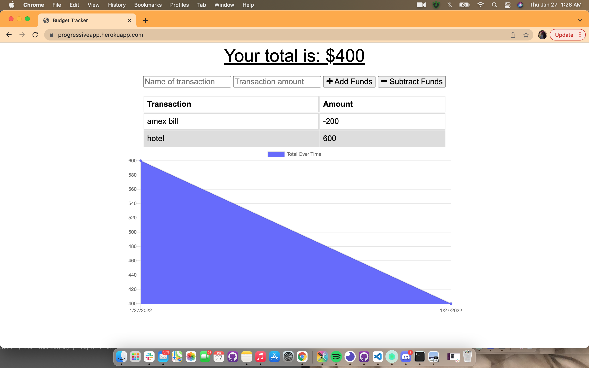

# Progressive Web App
Homework 18

 

# Link to deployed app

## [Click](https://progressiveapp.herokuapp.com/)

# Technologies used:

Node.js, Mongoose, Mysql, MongoDB, Express

# Overview

For this assignment, I need to give workers a fast and easy way to track their money, but allowing them to access that information anytime is even more important. Having offline functionality is paramount to our applications success.

# License
MIT
 
# Contact Info
https://github.com/bryonbsmb1